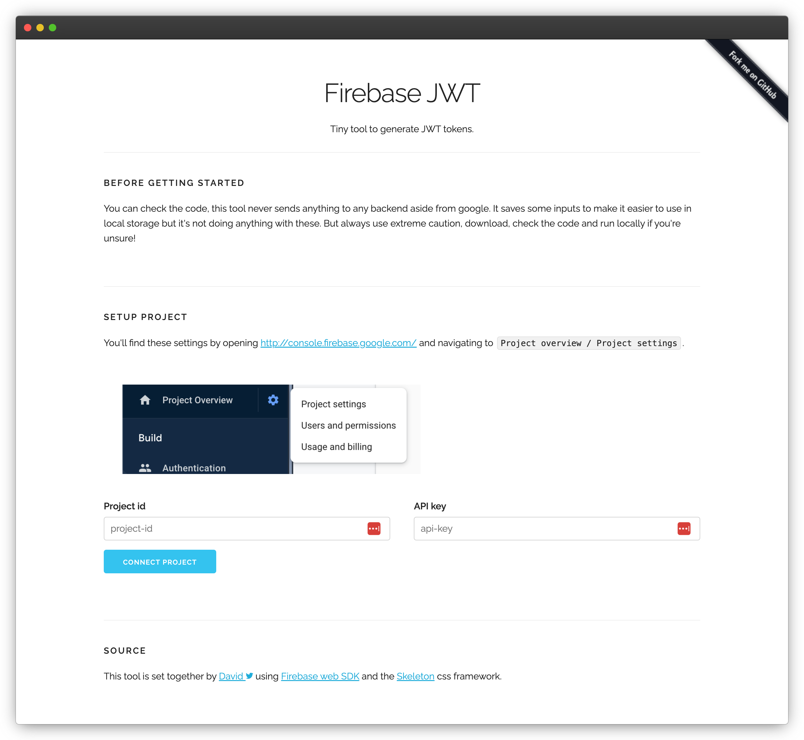

# Firebase JWT

This is a small tool to help you login to get JWT tokens for testing in Firebase.

Getting a JWT token for an account with username & password is easy, you can use this CURL command provided by [Cheche on stackoverflow](https://stackoverflow.com/a/53134529/479632):

```
curl 'https://www.googleapis.com/identitytoolkit/v3/relyingparty/verifyPassword?key=[API_KEY]' \
-H 'Content-Type: application/json' \
--data-binary '{"email":"[user@example.com]","password":"[PASSWORD]","returnSecureToken":true}'
```

But if you want to get the JWT for a google account or having phone number login or so, it's a bit trickier so I created this tiny app to help.

## The app



If you run this locally, it will likely work out-of-the-box as you've probably got `localhost` added to you Firebase Authorized domains.

If you want to run it without cloning the repo, you can access a hosted version on https://ddikman.github.io/firebase-jwt/ just make sure you add it to your `Authorized domains`

### Running locally

Unfortunatly, the firebase requires some browser functionlity that's not available when serving from file, so instead we run a simply web server to host the html. Any web server will do. There is a simple node server already configured for you in this repo.

To run this project simply clone it and then run (with nodejs installed):
```shell
npm install
npm start
```

## Security

You can check the code, this tool never sends anything to any backend aside from google. It saves some inputs to make it easier to use in local storage but it's not doing anything with these. But always use extreme caution, download, check the code and run locally if you're unsure!
